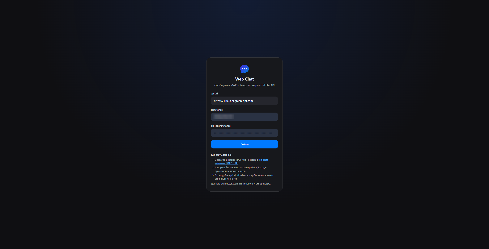
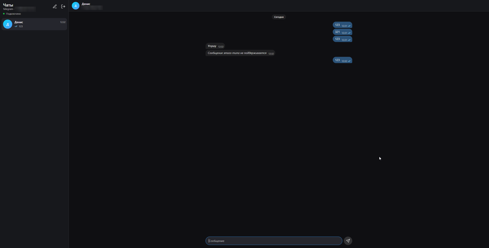
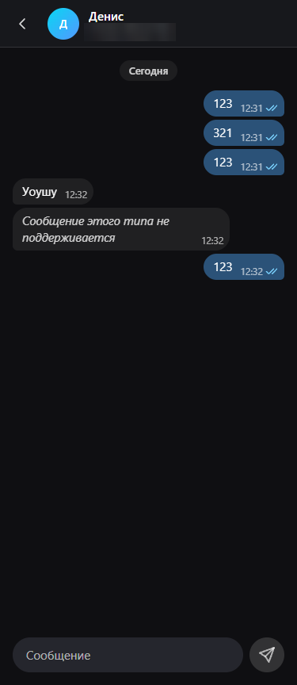

# Web Chat для MAX и Telegram на GREEN-API

[](https://github.com/MrDenzzz/green-api-web-chat/actions/workflows/ci.yml)

**Демо:** https://mrdenzzz.github.io/green-api-web-chat/

Веб-интерфейс для переписки в MAX и Telegram через [GREEN-API](https://green-api.com). Можно войти по данным инстанса, начать чат по номеру телефона, отправлять и получать текстовые сообщения и видеть статусы доставки. Интерфейс оформлен по образцу [web.max.ru](https://web.max.ru). Проект сделан как тестовое задание GREEN-API.

**Стек:** React 19, TypeScript (strict), Vite, Zustand, Zod, CSS Modules, Vitest и Testing Library, ESLint и Prettier, GitHub Actions, Vercel.

[English version below](#in-english)

## Скриншоты

**Вход**



**Переписка**



**Мобильная версия**



## Возможности

- Вход по `apiUrl`, `idInstance` и `apiTokenInstance`. Данные проверяются через getStateInstance, мессенджер (MAX или Telegram) определяется автоматически.
- Приложение проверяет настройки уведомлений инстанса и включает их одной кнопкой: без них ответы собеседника не придут.
- Новый чат создаётся по номеру телефона в любом привычном формате, в Telegram ещё и по `@username`.
- Сообщения отправляются через SendMessage. Получение идёт через HTTP API: receiveNotification и deleteNotification в цикле long-poll.
- У исходящих сообщений видны статусы «отправляется», «отправлено», «доставлено», «прочитано» и «ошибка» с причиной и кнопкой «Повторить».
- Индикатор получения сообщений показывает три состояния: «подключено», «переподключение», «ошибка».
- Чаты сохраняются в браузере и переживают перезагрузку, выход из аккаунта всё удаляет.
- Вёрстка адаптируется до мобильной ширины, есть базовая доступность: семантика, видимый фокус, подписи у иконок.

## Быстрый старт

```bash
git clone https://github.com/MrDenzzz/green-api-web-chat.git && cd green-api-web-chat
npm ci
npm run dev
```

Откройте http://localhost:5173 и войдите данными инстанса. Нужен Node.js 22.12 или новее, версия для nvm лежит в `.nvmrc`.

## Как получить данные для входа

1. Зарегистрируйтесь в [личном кабинете GREEN-API](https://console.green-api.com) и создайте инстанс MAX или Telegram. Для проверки хватит бесплатного тарифа «Разработчик».
2. Авторизуйте инстанс: получите QR-код в личном кабинете и отсканируйте его в приложении мессенджера.
   - MAX: «Профиль → Устройства → Войти по QR-коду». Пока для входа по QR-коду в MAX нужно отключить пароль.
   - Telegram: «Настройки → Устройства → Подключить устройство».
3. На странице инстанса скопируйте `apiUrl`, `idInstance` и `apiTokenInstance` и вставьте их в форму входа.
4. Если у инстанса выключены уведомления, приложение предложит их включить. Инстанс перезапустится, настройки вступят в силу в течение 5 минут.

Ограничения тарифа «Разработчик»: 3 чата в месяц и 100 проверок номеров. В MAX через GREEN-API можно писать только на номера России (+7) и Беларуси (+375).

## Как это устроено

```
src/
├─ api/          GREEN-API без React: клиент, Zod-схемы, парсер уведомлений, ошибки, цикл опроса
├─ store/        Zustand: сессия и чаты; логика чатов собрана в чистом редьюсере
├─ hooks/        опрос уведомлений, отправка сообщений, проверка настроек инстанса
├─ components/   экраны и UI-кит на CSS Modules
├─ lib/          номера телефонов, форматирование времени, backoff
└─ test/         фикстуры: JSON-примеры уведомлений из документации GREEN-API
```

**Слои.** Папка `api/` ничего не знает о React. Клиент обёртывает `fetch`, проверяет каждый ответ через Zod и превращает любой сбой в `GreenApiError` с конкретной причиной: неверный токен, инстанс не авторизован, нет сети, превышен лимит и так далее. Интерфейс показывает по этой причине понятный текст, а цикл опроса решает, повторять запрос или остановиться. GREEN-API разрешает запросы из браузера (CORS), поэтому бэкенда нет. Данные для входа не покидают браузер и уходят только на `apiUrl` инстанса.

**Почему long-poll, а не опрос по таймеру.** receiveNotification держит запрос до `receiveTimeout` (здесь 20 секунд) и отвечает сразу, как только появится уведомление. Сообщения приходят без задержки, а пустой чат делает один запрос в 20 секунд вместо запроса каждые несколько секунд: так бережнее к лимитам API и к батарее. Цикл обрабатывает уведомления по одному: получить, применить, удалить. Удаление выполняется всегда, даже для типов, которые приложение пропускает. Очередь работает по принципу FIFO, и неудалённое уведомление заблокировало бы всё, что за ним. При ошибках цикл ждёт с экспоненциальной паузой и случайным разбросом, от 0,5–1 до 15–30 секунд. Ошибки, которые сами не пройдут (неверный токен, у инстанса задан webhook), останавливают цикл, а в интерфейсе появляются причина и кнопка «Повторить». Скрытая вкладка не опрашивает сервер: текущий запрос прерывается, и цикл начинается заново, когда вкладку снова открыли или вернулась сеть. Выход и размонтирование останавливают цикл через `AbortController`.

**Стор.** Два стора Zustand сохраняются в localStorage: сессия (данные для входа, мессенджер) и чаты (список чатов и сообщения). Логика чатов собрана в чистом редьюсере, стор только вызывает его через `dispatch`, поэтому её легко тестировать. Уведомление может прийти повторно: если удаление не удалось, сервер вернёт его ещё раз. Поэтому редьюсер идемпотентен: сообщения дедуплицируются по `idMessage`, а повтор возвращает тот же объект состояния и ничего не перерисовывает. У сохранённой схемы есть версия, и данные неизвестной версии сбрасываются, приложение при этом не падает. В каждом чате хранится до 500 последних сообщений, чтобы не упереться в квоту localStorage. Сообщения, которые отправлялись в момент закрытия страницы, после перезагрузки помечаются ошибкой: ответа на их запрос уже не будет.

**Статусы.** Исходящее сообщение появляется сразу со статусом «отправляется». Когда SendMessage возвращает `idMessage`, статус меняется на «отправлено». В документации MAX и Telegram нет уведомления со статусом `sent`, поэтому этот статус берётся из ответа на запрос. Дальше уведомления `outgoingMessageStatus` переводят сообщение в «доставлено» и «прочитано» или в «ошибку» с причиной (`noAccount`, `notInGroup`, `failed`).

Статусы двигаются только вперёд. Запоздавшее «доставлено» после «прочитано» игнорируется. А «доставлено» после «ошибки» побеждает: это более свежее подтверждение.

Учтены две гонки:

- статус может прийти раньше ответа SendMessage — тогда он ждёт в буфере, пока сообщение не получит свой `idMessage`;
- уведомление `outgoingAPIMessageReceived` может обогнать ответ — тогда редьюсер склеивает оба сообщения по `idMessage`.

Сообщения в один чат уходят строго по очереди, чтобы собеседник получил их в том порядке, в каком они написаны.

**MAX и Telegram.** GREEN-API обслуживает оба мессенджера одними методами и форматами уведомлений. Различия собраны в `src/api/messengers.ts`: значение `typeInstance`, лимит длины сообщения (4000 и 4096 символов), номера, которые принимает CheckAccount, и поиск по `@username` в Telegram. Мессенджер определяется при входе по getSettings. Чат создаётся через CheckAccount, потому что во входящих уведомлениях приходит числовой `chatId`, а не номер телефона: чат, созданный как `79991234567@c.us`, не совпал бы с ответами.

**Настройки уведомлений.** Уведомления попадают в очередь, только если у инстанса включены `incomingWebhook`, `outgoingWebhook` и `outgoingAPIMessageWebhook`, а `webhookUrl` пуст: HTTP API и webhook не работают одновременно. При входе приложение проверяет это через getSettings и предлагает включить всё одним вызовом setSettings.

## Скрипты

| Команда                                   | Что делает                             |
| ----------------------------------------- | -------------------------------------- |
| `npm run dev`                             | dev-сервер на http://localhost:5173    |
| `npm run build` / `npm run preview`       | production-сборка и её просмотр        |
| `npm run typecheck`                       | проверка типов TypeScript              |
| `npm run lint`                            | ESLint с правилами, учитывающими типы  |
| `npm run format` / `npm run format:check` | форматирование Prettier и его проверка |
| `npm test` / `npm run test:watch`         | тесты Vitest                           |

## Тесты

- **Парсер уведомлений** проверяется на JSON-примерах из документации MAX и Telegram, скопированных один в один.
- **Редьюсер:** дедупликация, порядок сообщений, статусы, гонки, повторная отправка, сохранение и восстановление.
- **Цикл опроса и его хук:** удаление уведомлений, backoff, фатальные ошибки, пауза на скрытой вкладке, отмена запросов.
- **API-клиент:** адреса запросов, пустые ответы, коды ошибок, таймаут, маскировка токена в ошибках.
- **Компоненты:** форма входа, создание чата, поле ввода, баннер настроек. Есть сквозной сценарий: создать чат по номеру, отправить сообщение, получить уведомление.

GitHub Actions запускает lint, проверку форматирования, typecheck, тесты и сборку на каждый push и pull request. После успешных проверок ветки `main` он выкладывает демо на GitHub Pages.

## Деплой

Демо публикуется на [GitHub Pages](https://mrdenzzz.github.io/green-api-web-chat/) из того же workflow, что и проверки. Если lint, тесты и сборка прошли, CI собирает приложение с базовым путём `/green-api-web-chat/` (переменная `BASE_PATH`) и выкладывает его. В настройках репозитория нужно один раз выбрать источник: Settings → Pages → Source → GitHub Actions.

Проект готов и к [Vercel](https://vercel.com): достаточно импортировать репозиторий. Настройки сборки лежат в `vercel.json`, там же заданы заголовки безопасности: Content Security Policy и запрет встраивания страницы во фрейм. Основная ссылка на демо ведёт на GitHub Pages, потому что адреса `*.vercel.app` в России открываются не у всех провайдеров.

## Известные ограничения

- **Только текст.** Фото, стикеры, файлы и другие нетекстовые сообщения показываются плашкой «Сообщение этого типа не поддерживается». Реакции, правки и удаления сообщений не отображаются.
- **Нет истории.** Показывается только то, что пришло через очередь уведомлений. Очередь хранит уведомления 24 часа, более старую переписку приложение не загружает.
- **Одна вкладка.** Если открыть приложение в нескольких вкладках, каждая будет забирать уведомления из общей очереди. Новые сообщения появятся в одной из них, остальные увидят их только после перезагрузки.
- **Прерванная отправка.** Если закрыть страницу во время отправки, сообщение будет помечено ошибкой, даже если сервер успел его отправить. Повторная отправка может создать дубль.
- **Данные только в этом браузере.** В каждом чате хранится до 500 сообщений. Токен лежит в localStorage и доступен скриптам страницы. Сторонних скриптов в приложении нет. На Vercel заголовки CSP ограничивают, откуда скрипты можно загрузить, а GitHub Pages свои заголовки задавать не позволяет. Для продакшена токен лучше держать на своём бэкенде.
- **Порядок сообщений.** Время своих сообщений берётся с часов компьютера, время входящих — с сервера. Если часы заметно спешат, порядок в ленте может сбиться.
- **Ограничения GREEN-API:** тариф «Разработчик» даёт 3 чата в месяц и 100 проверок номеров; в MAX можно писать только на номера +7 и +375; getSettings и setSettings принимают не больше одного запроса в секунду.

## In English

A web chat for MAX and Telegram built on [GREEN-API](https://green-api.com). It lets you sign in with an instance's credentials, start a chat by phone number (or by @username in Telegram), and send and receive text messages with delivery statuses. The look follows web.max.ru. Messages are received through the HTTP API with a long-poll loop (receiveNotification + deleteNotification) that deletes every notification after handling it, backs off on errors and pauses in hidden tabs. Chats persist in localStorage, and notifications are deduplicated by `idMessage`.

Built with React 19, TypeScript in strict mode, Vite, Zustand, Zod and CSS Modules. Tested with Vitest and Testing Library.

**Demo:** https://mrdenzzz.github.io/green-api-web-chat/

**Quick start**

```bash
git clone https://github.com/MrDenzzz/green-api-web-chat.git && cd green-api-web-chat
npm ci
npm run dev
```

Open http://localhost:5173 and sign in with `apiUrl`, `idInstance` and `apiTokenInstance` from the [GREEN-API console](https://console.green-api.com). Requires Node.js 22.12+.
